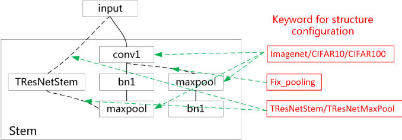
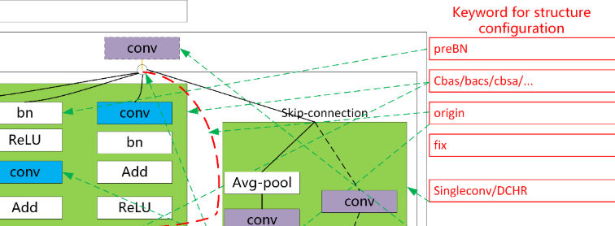
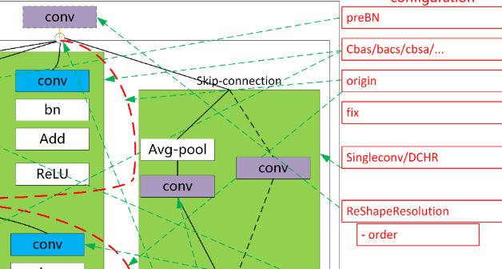
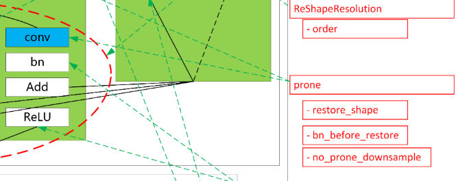
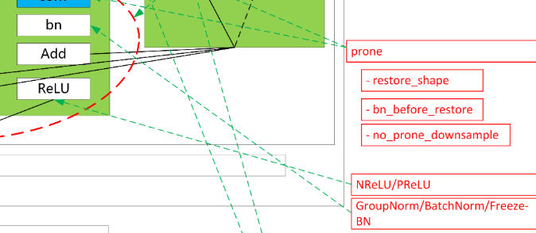

# Resnet Architecture

To use the resnet architecture, one can set the `arch` option to either `resnet18/34/50/101` or `pytorch-resnet18/34/50/101`. The former is realized in `model/resnet_.py` and the later is implemented in `model/resnet.py`.  The difference between the choice is that the later one is from the pytorch offical and the former is more flexible. Users can customize the Resnet architecture variants with different combination of options for `resnet18/34/50/101`. The combination is possible by setting segments in `keyword`.

For example, by add `origin,cbsa,fix_pooling,singleconv,fix` in the keyword, we obtain the pytorch official architecture (the same with the `pytorch-resnet18/34/50/101`). Fine-grain control is supported for the stem and body.

Download the [QTool.png](./QTool.png) to view in a whole.

## Stem

1. `imagenet` or `CIFAR10` / `CIFAR100` to change the first convolution hyperparameter (as well as the maxpool layer).

  For imagenet, the conv is `kernel_size7x7, stride=2, pad=3`.
  
  For CIFAR10/CIFAR100, the conv is `kernel_size` and no `maxpool`.
  
  Besides, set `alpha_width = 0.25` for CIFAR architecture to shrink the channel width.

2. `fix_pooling` to choose whether the `bn` layer should be moved before `maxpool` layer.

3. `TRe` is an alternative implementation of the Stem.

## Body

- Default buildup

- Lossless downsample network

- Prone: Point-wise and Reshape Only Network

- Specific Activation and Normalization

